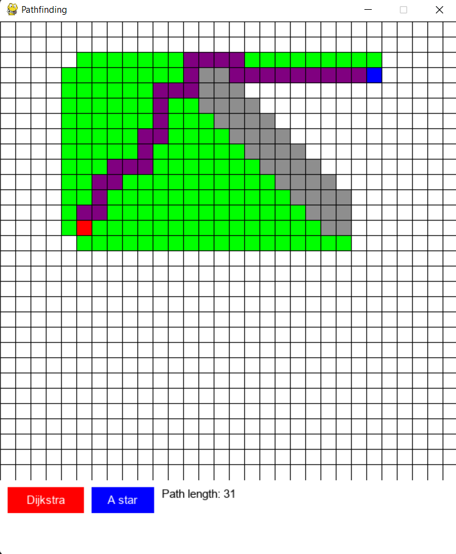

# Pathfinding 

Pathfinding visualizer in PyGame 

## Implementation
This pathfinding visualizer uses ideas from graph theory in order to construct a graph from a grid. 

Various different algorithms can be implemented easily in `pathfinding.py`.

## Usage
#### Keys:
S: place start node (in red)

E: place end node (in blue)

R: Run algorithm

C: Clear board
#### Mouse
Use left mouse click to place node and right mouse click to clear node.

#### Nodes
Red Node: Start node

Blue Node: End node

Grey Node: Obstacle

Green Nodes: Visited Nodes

Purple Nodes: Found path
